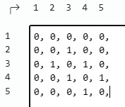
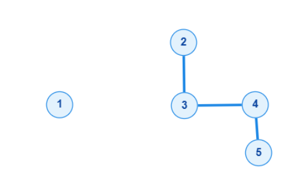

# CSES - Counting Rooms

## Participantes:
- Samuel Ribeiro Benicio
- Adriel Medeiro Lins
- Manoel Sergio Costa Lima Filho

## Lista de adjacência


## Leitura da entrada; construção do grafo
```text
4 4
####
##.#
.#..
###.
```

Resultado esperado:
```text
2
```



## Medidas estruturais pertinentes da Unidade I
- Grau máximo no exemplo apresentado é: 2, nos vértices 3 e 4
- Grau mínimo no exemplo apresentado é: 0, no vértice 1